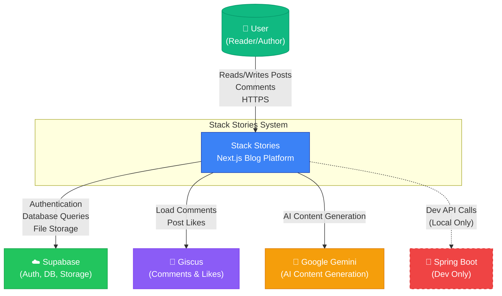
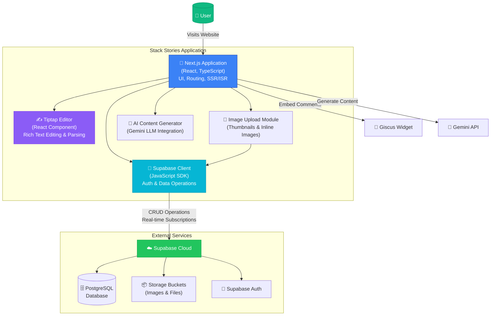
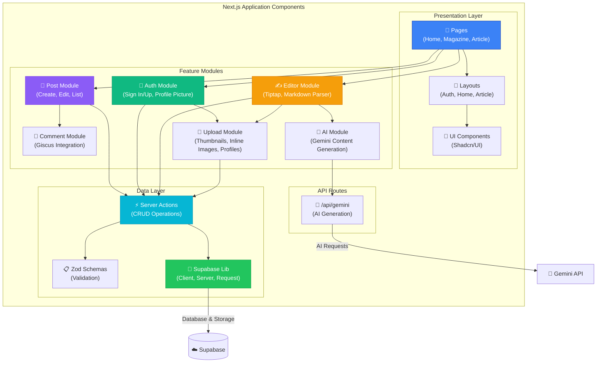
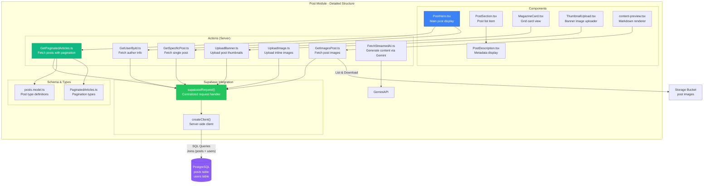
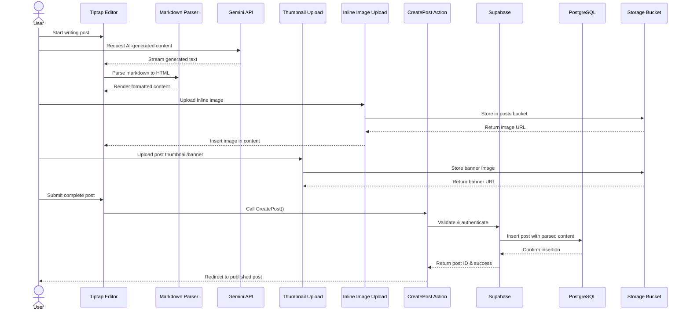
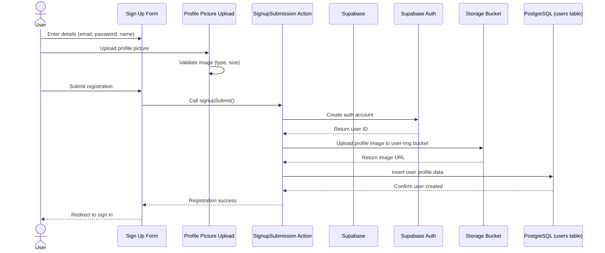

# Stack Stories

A modern, full-featured blog platform built with Next.js 14+, Supabase, and TypeScript. Create rich content with an integrated Tiptap editor, manage media uploads, and engage with readers through comments and social features.

---

## ✨ Features

### Core Functionality

- **Rich Text Editor**: Tiptap-powered markdown editor with AI-assisted content generation
- **AI Content Generation**: Integrated Google Gemini LLM for intelligent content creation
- **Thumbnail Upload**: Upload custom thumbnails/banners for posts
- **Inline Image Upload**: Upload and embed images directly within post content
- **Content Parsing**: Automatic markdown to HTML conversion with rich formatting
- **Profile Picture Upload**: Upload custom profile pictures during sign-up and profile editing
- **Image Management**: Comprehensive media library for post banners and user avatars
- **Authentication**: Secure user authentication and authorization via Supabase
- **Comments & Engagement**: Giscus integration for comments and post likes
- **Pagination**: Clean, responsive post browsing with pagination support
- **Responsive Design**: Mobile-first design with Tailwind CSS

### User Experience

- **GSAP Animations**: Smooth, professional page transitions and interactions
- **3D Elements**: Three.js integration for visual enhancements
- **Dark Mode Support**: Theme switching capabilities
- **SEO Optimized**: Server-side rendering for better search engine visibility

### Developer Features

- **TypeScript**: Fully typed for better developer experience
- **Unit Testing**: Jest test suite for reliable code
- **Schema Validation**: Zod for runtime type safety
- **Component Library**: Shadcn/UI components

---

## 🏗️ Architecture

Stack Stories follows a modern **Monolithic Next.js** architecture with **Supabase** as the backend platform.

### Current Architecture

- **Frontend**: Next.js 14+ with React Server Components
- **Backend**: Supabase (Authentication, Database, Storage)
- **Database**: PostgreSQL via Supabase
- **File Storage**: Supabase Storage buckets
- **Comments**: Giscus (GitHub Discussions-based)

### Future Roadmap

- **Analytics Dashboard**: Angular-based Microfrontend architecture
- **Premium Features**: Subscription system for exclusive content
- **Real-time Features**: Live notifications and updates

> **Note**: Spring Boot is used only for local development practice and is **not deployed in production**.

---

## 📐 C4 Architecture Diagrams

### Level 1: System Context Diagram



### Level 2: Container Diagram



### Level 3: Component Diagram



### Level 4: Code Diagram - Post Module



### Data Flow - Create Article



### Data Flow - Sign Up with Profile Picture



---

## 🛠️ Tech Stack

### Frontend

- **Framework**: Next.js 14+ (App Router)
- **Language**: TypeScript
- **UI Library**: React 18
- **Styling**: Tailwind CSS
- **Components**: Shadcn/UI
- **Animations**: GSAP
- **3D Graphics**: Three.js
- **Rich Text**: Tiptap
- **Validation**: Zod

### Backend & Services

- **BaaS**: Supabase
- **Database**: PostgreSQL
- **Authentication**: Supabase Auth
- **Storage**: Supabase Storage
- **Comments**: Giscus

### Development

- **Testing**: Jest
- **Linting**: ESLint
- **Formatting**: Prettier

---

## 🚀 Getting Started

### Prerequisites

- Node.js 18+
- npm or yarn or pnpm
- Supabase account

### Installation

1. **Clone the repository**

   ```bash
   git clone https://github.com/Ahmed-Elgendy25/my-blog-post.git
   cd my-blog-post
   ```

2. **Install dependencies**

   ```bash
   npm install
   ```

3. **Run the development server**

   ```bash
   npm run dev
   ```

4. **Open your browser**

   Navigate to [http://localhost:3000](http://localhost:3000)

---

## 📁 Project Structure

```
blog-post-app/
├── app/                          # Next.js app directory
│   ├── (auth)/                   # Authentication routes
│   │   ├── signin/
│   │   └── signup/
│   ├── (home)/                   # Home and magazine routes
│   │   ├── magazine/
│   │   └── _components/
│   ├── create-article/           # Article creation
│   ├── shared/                   # Shared components
│   └── api/                      # API routes
├── components/                   # Reusable UI components
│   └── ui/                       # Shadcn/UI components
├── lib/                          # Utility libraries
│   └── supabase/                 # Supabase client setup
├── hooks/                        # Custom React hooks
├── constants/                    # Application constants
├── utils/                        # Utility functions
├── __tests__/                    # Test files
└── public/                       # Static assets
```

---

## 🧪 Testing

Run the test suite:

```bash
npm run test
```

Run tests in watch mode:

```bash
npm run test:watch
```

Generate coverage report:

```bash
npm run test:coverage
```

## 📝 Key Features Explained

### Rich Text Editor

The Tiptap editor provides:

- Markdown support
- Image insertion
- Code blocks with syntax highlighting
- AI-powered content generation
- Real-time preview

### Authentication Flow

1. User signs up with email/password
2. Supabase handles email verification
3. Profile data stored in users table
4. Session managed via cookies

### Image Upload

- Profile images: Stored in `user-img` bucket
- Post banners: Stored in `posts` bucket
- Automatic image optimization
- CDN delivery via Supabase

## 👤 Author

**Ahmed Elgendy**

- GitHub: [@Ahmed-Elgendy25](https://github.com/Ahmed-Elgendy25)
- Repository: [my-blog-post](https://github.com/Ahmed-Elgendy25/my-blog-post)

---
