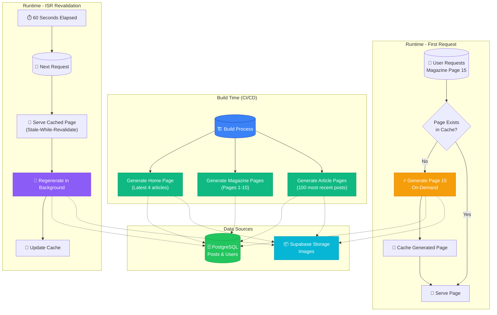
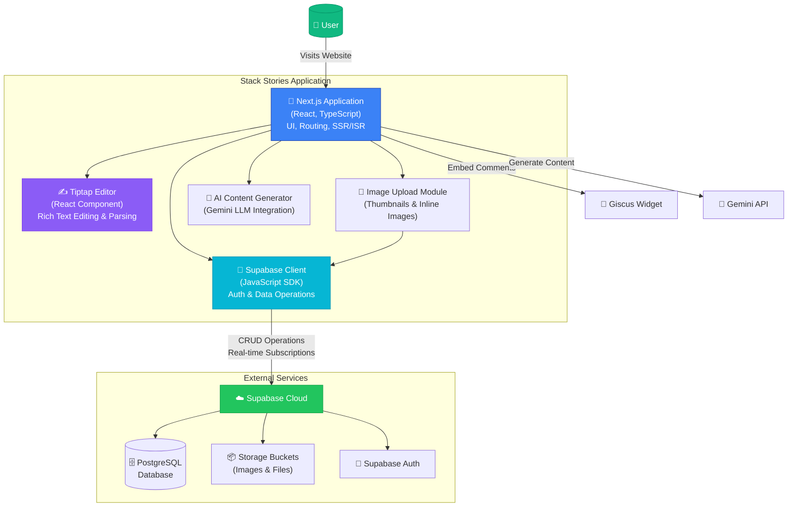
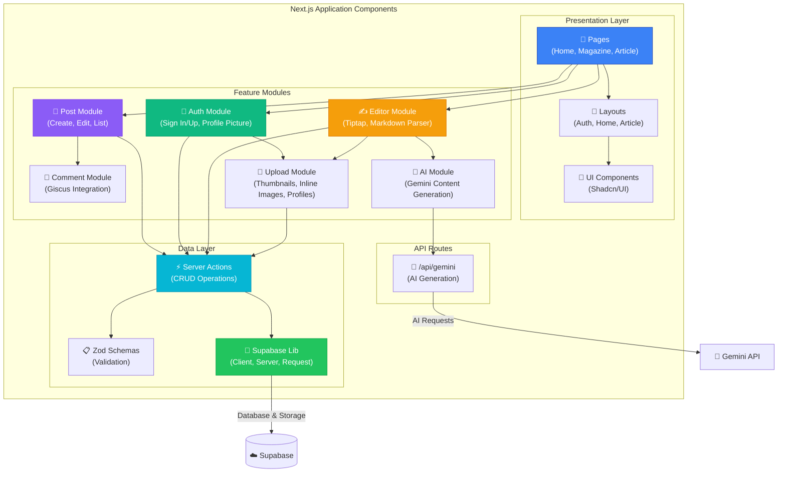
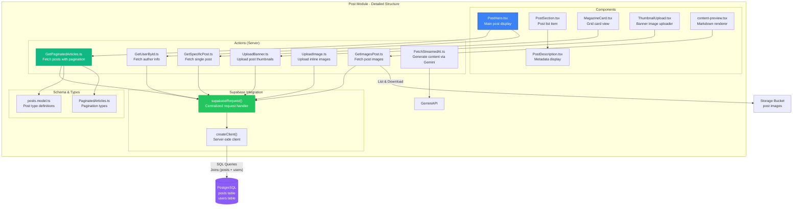
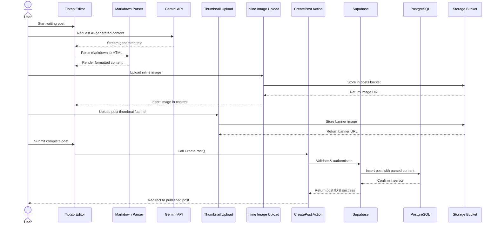
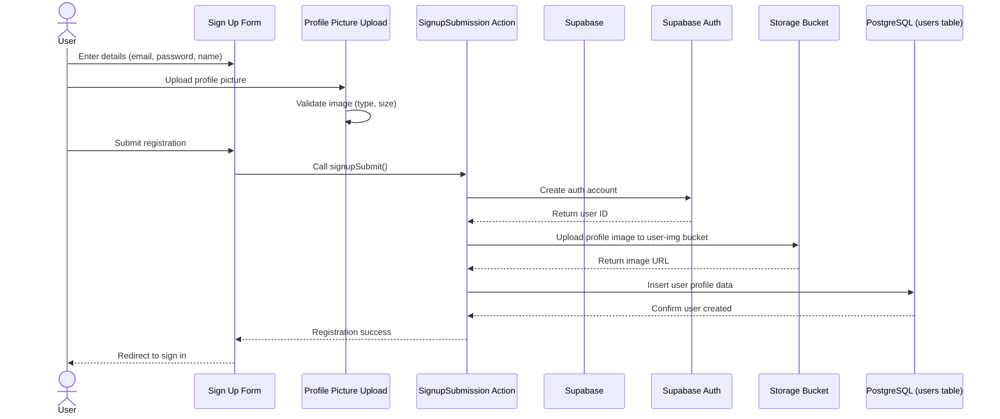

# Stack Stories

A modern, full-featured blog platform built with Next.js 14+, Supabase, and TypeScript. Create rich content with an integrated Tiptap editor, manage media uploads, and engage with readers through comments and social features.

---

## ✨ Features

### Core Functionality

- **Rich Text Editor**: Tiptap-powered markdown editor with AI-assisted content generation
- **AI Content Generation**: Integrated Google Gemini LLM for intelligent content creation
- **Thumbnail Upload**: Upload custom thumbnails/banners for posts
- **Inline Image Upload**: Upload and embed images directly within post content
- **Content Parsing**: Automatic markdown to HTML conversion with rich formatting
- **Profile Picture Upload**: Upload custom profile pictures during sign-up and profile editing
- **Image Management**: Comprehensive media library for post banners and user avatars
- **Authentication**: Secure user authentication and authorization via Supabase
- **Comments & Engagement**: Giscus integration for comments and post likes
- **Social Sharing**: Share articles on social media platforms (Twitter, Facebook, LinkedIn, etc.)
- **Pagination**: Clean, responsive post browsing with pagination support
- **Responsive Design**: Mobile-first design with Tailwind CSS

### User Experience

- **GSAP Animations**: Smooth, professional page transitions and interactions
- **3D Elements**: Three.js integration for visual enhancements
- **Dark Mode Support**: Theme switching capabilities
- **SEO Optimized**: Server-side rendering for better search engine visibility

### Developer Features

- **TypeScript**: Fully typed for better developer experience
- **Unit Testing**: Jest test suite for reliable code
- **Schema Validation**: Zod for runtime type safety
- **Component Library**: Shadcn/UI components

---

## 🏗️ Architecture

Stack Stories follows a modern **Monolithic Next.js** architecture with **Supabase** as the backend platform.

### Current Architecture

- **Frontend**: Next.js 14+ with React Server Components
- **Backend**: Supabase (Authentication, Database, Storage)
- **Database**: PostgreSQL via Supabase
- **File Storage**: Supabase Storage buckets
- **Comments**: Giscus (GitHub Discussions-based)

### Future Roadmap

- **Analytics Dashboard**: Angular-based Microfrontend architecture
- **Premium Features**: Subscription system for exclusive content
- **Real-time Features**: Live notifications and updates
- **Password Recovery**: Forgot password functionality for account recovery

> **Note**: Spring Boot is used only for local development practice and is **not deployed in production**.

---

## 🔄 Rendering Patterns

Stack Stories implements a hybrid rendering strategy using **Static Site Generation (SSG)** combined with **Incremental Static Regeneration (ISR)** to optimize performance, SEO, and content freshness.

### Overview

The application uses Next.js 14+ rendering patterns to balance static generation benefits with dynamic content updates:

- **Static Generation (SSG)**: Pages are pre-rendered at build time for optimal performance
- **Incremental Static Regeneration (ISR)**: Static pages automatically revalidate and regenerate with fresh content
- **On-Demand Generation**: Pages not pre-generated are created on first request and cached

### Implementation Details

#### 1. **Home Page** (`app/(home)/page.tsx`)

**Pattern**: SSG + ISR

```typescript
export const revalidate = 60; // Revalidate every 60 seconds
```

**Behavior**:

- Pre-rendered at build time with initial articles
- Automatically revalidates every 60 seconds
- Shows latest 4 articles without rebuild
- Provides instant load times with fresh content

**Benefits**:

- **Performance**: Static HTML served instantly
- **SEO**: Fully crawlable by search engines
- **Freshness**: Content updates every minute without deployment

---

#### 2. **Magazine Page** (`app/(home)/magazine/page.tsx`)

**Pattern**: SSG + ISR with Dynamic Parameters

```typescript
export const revalidate = 60;

export async function generateStaticParams() {
  // Pre-generate first 10 pages at build time
  return Array.from({ length: 10 }, (_, i) => ({
    page: String(i + 1),
  }));
}
```

**Behavior**:

- **Build Time**: Generates pages 1-10 statically
- **Runtime**: Pages 11+ generated on-demand when first accessed
- **Revalidation**: All pages refresh every 60 seconds
- **Caching**: On-demand pages cached after first request

**Benefits**:

- **Scalability**: Doesn't slow builds with hundreds of pages
- **Efficiency**: Most-visited pages (1-10) pre-built
- **Flexibility**: New pages generated automatically as content grows

---

#### 3. **Article Detail Page** (`app/(home)/magazine/[id]/page.tsx`)

**Pattern**: SSG + ISR with Database-Driven Parameters

```typescript
export const revalidate = 60;

export async function generateStaticParams() {
  const posts = await supabaseRequest(async (supabase) => {
    const { data } = await supabase
      .from("posts")
      .select("id")
      .order("date", { ascending: false })
      .limit(100); // Most recent 100 posts

    return data || [];
  });

  return posts.map((post) => ({ id: post.id }));
}
```

**Behavior**:

- **Build Time**: Generates static HTML for 100 most recent articles
- **Runtime**: Older articles generated on-demand when accessed
- **Revalidation**: All article pages refresh every 60 seconds
- **Database Query**: Fetches post IDs at build time for static generation

**Benefits**:

- **SEO Optimization**: Most important content pre-rendered and indexed
- **Build Performance**: Limits build time by generating only recent posts
- **Complete Coverage**: All articles accessible via on-demand generation
- **Fresh Content**: Comments, likes, and updates appear within 60 seconds

---

### Rendering Flow



### Performance Characteristics

| Page Type             | Build Time Generation | On-Demand Generation | Revalidation | Cache Strategy           |
| --------------------- | --------------------- | -------------------- | ------------ | ------------------------ |
| **Home**              | ✅ Always             | ❌ No                | 60s          | Stale-while-revalidate   |
| **Magazine (p1-10)**  | ✅ Yes                | ❌ No                | 60s          | Stale-while-revalidate   |
| **Magazine (p11+)**   | ❌ No                 | ✅ Yes               | 60s          | Generated on first visit |
| **Article (Top 100)** | ✅ Yes                | ❌ No                | 60s          | Stale-while-revalidate   |
| **Article (Older)**   | ❌ No                 | ✅ Yes               | 60s          | Generated on first visit |

### Key Benefits

#### 🚀 Performance

- **TTFB (Time to First Byte)**: < 100ms for pre-rendered pages
- **FCP (First Contentful Paint)**: < 1s with static HTML
- **No Database Queries**: On cached hits, zero database load
- **CDN Distribution**: Static assets served from edge locations

#### 🔍 SEO Optimization

- **Pre-rendered HTML**: Search engines crawl full content immediately
- **Dynamic Meta Tags**: Each page has unique title and description
- **Fresh Content**: Regular revalidation keeps content current for crawlers
- **100% Coverage**: All content accessible via static or on-demand generation

#### 💰 Cost Efficiency

- **Reduced Database Calls**: Cached pages serve thousands of users
- **Lower Server Load**: Static files don't require server processing
- **Bandwidth Optimization**: CDN caching reduces origin requests
- **Predictable Costs**: Build-time generation avoids per-request charges

#### 🔄 Content Freshness

- **60-Second Updates**: Changes appear within a minute
- **No Deployment Needed**: Content updates without rebuild
- **Stale-While-Revalidate**: Users always see content immediately
- **Background Regeneration**: Updates happen transparently

### Configuration Summary

```typescript
// All pages use this configuration
export const revalidate = 60; // ISR: Revalidate every 60 seconds

// Magazine pagination: Pre-generate 10 pages
export async function generateStaticParams() {
  return Array.from({ length: 10 }, (_, i) => ({
    page: String(i + 1),
  }));
}

// Article pages: Pre-generate 100 most recent
export async function generateStaticParams() {
  const posts = await fetchRecentPosts(100);
  return posts.map((post) => ({ id: post.id }));
}
```

---

## 📐 C4 Architecture Diagrams

### Level 1: System Context Diagram

```mermaid
graph TB
    User[("👤 User<br/>(Reader/Author)")]

    subgraph "Stack Stories System"
        StackStories["Stack Stories<br/>Next.js Blog Platform"]
    end

    Supabase["☁️ Supabase<br/>(Auth, DB, Storage)"]
    Giscus["💬 Giscus<br/>(Comments & Likes)"]
    Gemini["🤖 Google Gemini<br/>(AI Content Generation)"]
    SpringBoot["🔧 Spring Boot<br/>(Dev Only)"]

    User -->|"Reads/Writes Posts<br/>Comments<br/>HTTPS"| StackStories
    StackStories -->|"Authentication<br/>Database Queries<br/>File Storage"| Supabase
    StackStories -->|"Load Comments<br/>Post Likes"| Giscus
    StackStories -->|"AI Content Generation"| Gemini
    StackStories -.->|"Dev API Calls<br/>(Local Only)"| SpringBoot

    style StackStories fill:#3b82f6,stroke:#1e40af,color:#fff
    style User fill:#10b981,stroke:#059669,color:#fff
    style Supabase fill:#22c55e,stroke:#16a34a,color:#fff
    style Giscus fill:#8b5cf6,stroke:#7c3aed,color:#fff
    style Gemini fill:#f59e0b,stroke:#d97706,color:#fff
    style SpringBoot fill:#ef4444,stroke:#dc2626,color:#fff,stroke-dasharray: 5 5
```



### Level 2: Container Diagram



### Level 3: Component Diagram



### Level 4: Code Diagram - Post Module



### Data Flow - Create Article



### Data Flow - Sign Up with Profile Picture



---

## 🛠️ Tech Stack

### Frontend

- **Framework**: Next.js 14+ (App Router)
- **Language**: TypeScript
- **UI Library**: React 18
- **Styling**: Tailwind CSS
- **Components**: Shadcn/UI
- **Animations**: GSAP
- **3D Graphics**: Three.js
- **Rich Text**: Tiptap
- **Validation**: Zod

### Backend & Services

- **BaaS**: Supabase
- **Database**: PostgreSQL
- **Authentication**: Supabase Auth
- **Storage**: Supabase Storage
- **Comments**: Giscus

### Development

- **Testing**: Jest
- **Linting**: ESLint
- **Formatting**: Prettier

---

## 🚀 Getting Started

### Prerequisites

- Node.js 18+
- npm or yarn or pnpm
- Supabase account

### Installation

1. **Clone the repository**

   ```bash
   git clone https://github.com/Ahmed-Elgendy25/my-blog-post.git
   cd my-blog-post
   ```

2. **Install dependencies**

   ```bash
   npm install
   ```

3. **Run the development server**

   ```bash
   npm run dev
   ```

4. **Open your browser**

   Navigate to [http://localhost:3000](http://localhost:3000)

---

## 📁 Project Structure

```
blog-post-app/
├── app/                          # Next.js app directory
│   ├── (auth)/                   # Authentication routes
│   │   ├── signin/
│   │   └── signup/
│   ├── (home)/                   # Home and magazine routes
│   │   ├── magazine/
│   │   └── _components/
│   ├── create-article/           # Article creation
│   ├── shared/                   # Shared components
│   └── api/                      # API routes
├── components/                   # Reusable UI components
│   └── ui/                       # Shadcn/UI components
├── lib/                          # Utility libraries
│   └── supabase/                 # Supabase client setup
├── hooks/                        # Custom React hooks
├── constants/                    # Application constants
├── utils/                        # Utility functions
├── __tests__/                    # Test files
└── public/                       # Static assets
```

---

## 🧪 Testing

Run the test suite:

```bash
npm run test
```

Run tests in watch mode:

```bash
npm run test:watch
```

Generate coverage report:

```bash
npm run test:coverage
```

## 📝 Key Features Explained

### Rich Text Editor

The Tiptap editor provides:

- Markdown support
- Image insertion
- Code blocks with syntax highlighting
- AI-powered content generation
- Real-time preview

### Authentication Flow

1. User signs up with email/password
2. Supabase handles email verification
3. Profile data stored in users table
4. Session managed via cookies

### Image Upload

- Profile images: Stored in `user-img` bucket
- Post banners: Stored in `posts` bucket
- Automatic image optimization
- CDN delivery via Supabase

## 👤 Author

**Ahmed Elgendy**

- GitHub: [@Ahmed-Elgendy25](https://github.com/Ahmed-Elgendy25)
- Repository: [my-blog-post](https://github.com/Ahmed-Elgendy25/my-blog-post)

---
