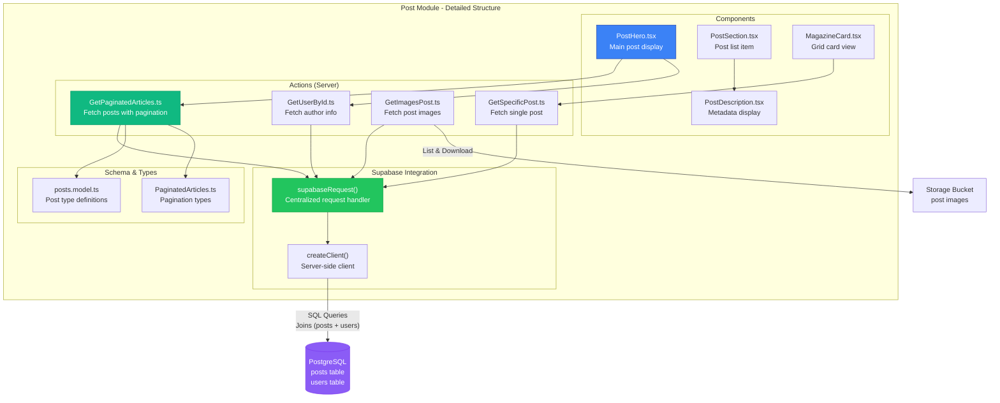
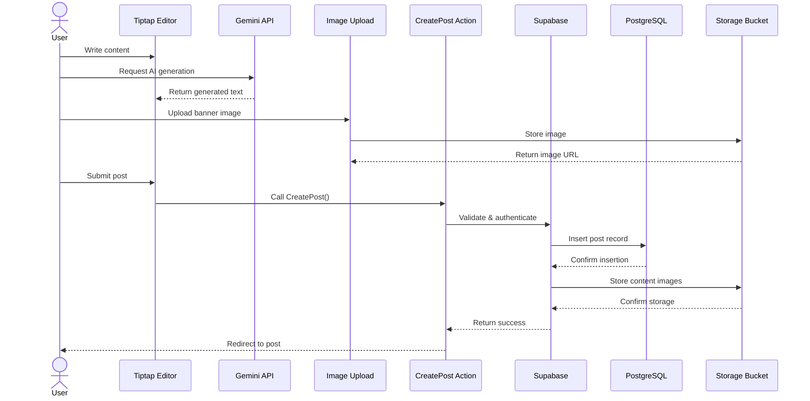

# Stack Stories

A modern, full-featured blog platform built with Next.js 14+, Supabase, and TypeScript. Create rich content with an integrated Tiptap editor, manage media uploads, and engage with readers through comments and social features.

---

## ✨ Features

### Core Functionality

- **Rich Text Editor**: Tiptap-powered markdown editor with AI assistance
- **Image Management**: Upload and manage post banners and user profile pictures
- **Authentication**: Secure user authentication and authorization via Supabase
- **Comments & Engagement**: Giscus integration for comments and post likes
- **Pagination**: Clean, responsive post browsing with pagination support
- **Responsive Design**: Mobile-first design with Tailwind CSS

### User Experience

- **GSAP Animations**: Smooth, professional page transitions and interactions
- **3D Elements**: Three.js integration for visual enhancements
- **Dark Mode Support**: Theme switching capabilities
- **SEO Optimized**: Server-side rendering for better search engine visibility

### Developer Features

- **TypeScript**: Fully typed for better developer experience
- **Unit Testing**: Jest test suite for reliable code
- **Schema Validation**: Zod for runtime type safety
- **Component Library**: Shadcn/UI components

---

## 🏗️ Architecture

Stack Stories follows a modern **Monolithic Next.js** architecture with **Supabase** as the backend platform.

### Current Architecture

- **Frontend**: Next.js 14+ with React Server Components
- **Backend**: Supabase (Authentication, Database, Storage)
- **Database**: PostgreSQL via Supabase
- **File Storage**: Supabase Storage buckets
- **Comments**: Giscus (GitHub Discussions-based)

### Future Roadmap

- **Analytics Dashboard**: Angular-based Microfrontend architecture
- **Premium Features**: Subscription system for exclusive content
- **Real-time Features**: Live notifications and updates

> **Note**: Spring Boot is used only for local development practice and is **not deployed in production**.

---

## 📐 C4 Architecture Diagrams

### Level 1: System Context Diagram

```mermaid
graph TB
    User[("👤 User<br/>(Reader/Author)")]

    subgraph "Stack Stories System"
        StackStories["Stack Stories<br/>Next.js Blog Platform"]
    end

    Supabase["☁️ Supabase<br/>(Auth, DB, Storage)"]
    Giscus["💬 Giscus<br/>(Comments & Likes)"]
    Gemini["🤖 Google Gemini<br/>(AI Content Generation)"]
    SpringBoot["🔧 Spring Boot<br/>(Dev Only)"]

    User -->|"Reads/Writes Posts<br/>Comments<br/>HTTPS"| StackStories
    StackStories -->|"Authentication<br/>Database Queries<br/>File Storage"| Supabase
    StackStories -->|"Load Comments<br/>Post Likes"| Giscus
    StackStories -->|"AI Content Generation"| Gemini
    StackStories -.->|"Dev API Calls<br/>(Local Only)"| SpringBoot

    style StackStories fill:#3b82f6,stroke:#1e40af,color:#fff
    style User fill:#10b981,stroke:#059669,color:#fff
    style Supabase fill:#22c55e,stroke:#16a34a,color:#fff
    style Giscus fill:#8b5cf6,stroke:#7c3aed,color:#fff
    style Gemini fill:#f59e0b,stroke:#d97706,color:#fff
    style SpringBoot fill:#ef4444,stroke:#dc2626,color:#fff,stroke-dasharray: 5 5
```



### Level 2: Container Diagram

```mermaid
graph TB
    User[("👤 User")]

    subgraph "Stack Stories Application"
        NextApp["📱 Next.js Application<br/>(React, TypeScript)<br/>UI, Routing, SSR/ISR"]
        SupabaseClient["🔌 Supabase Client<br/>(JavaScript SDK)<br/>Auth & Data Operations"]
        TiptapEditor["✍️ Tiptap Editor<br/>(React Component)<br/>Rich Text Editing"]

        NextApp --> SupabaseClient
        NextApp --> TiptapEditor
    end

    subgraph "External Services"
        SupabaseCloud["☁️ Supabase Cloud"]
        PostgreSQL[("🗄️ PostgreSQL<br/>Database")]
        Storage["📦 Storage Buckets<br/>(Images & Files)"]
        Auth["🔐 Supabase Auth"]

        SupabaseCloud --> PostgreSQL
        SupabaseCloud --> Storage
        SupabaseCloud --> Auth
    end

    Giscus["💬 Giscus Widget"]
    Gemini["🤖 Gemini API"]

    User -->|"Visits Website"| NextApp
    SupabaseClient -->|"CRUD Operations<br/>Real-time Subscriptions"| SupabaseCloud
    NextApp -->|"Embed Comments"| Giscus
    NextApp -->|"Generate Content"| Gemini

    style NextApp fill:#3b82f6,stroke:#1e40af,color:#fff
    style SupabaseClient fill:#06b6d4,stroke:#0891b2,color:#fff
    style TiptapEditor fill:#8b5cf6,stroke:#7c3aed,color:#fff
    style SupabaseCloud fill:#22c55e,stroke:#16a34a,color:#fff
    style User fill:#10b981,stroke:#059669,color:#fff
```



### Level 3: Component Diagram

```mermaid
graph TB
    subgraph "Next.js Application Components"
        subgraph "Presentation Layer"
            Pages["📄 Pages<br/>(Home, Magazine, Article)"]
            Layouts["🎨 Layouts<br/>(Auth, Home, Article)"]
            UIComponents["🧩 UI Components<br/>(Shadcn/UI)"]
        end

        subgraph "Feature Modules"
            AuthModule["🔐 Auth Module<br/>(Sign In/Up, Profile)"]
            PostModule["📝 Post Module<br/>(Create, Edit, List)"]
            CommentModule["💬 Comment Module<br/>(Giscus Integration)"]
            EditorModule["✍️ Editor Module<br/>(Tiptap, AI, Upload)"]
        end

        subgraph "Data Layer"
            Actions["⚡ Server Actions<br/>(CRUD Operations)"]
            Schemas["📋 Zod Schemas<br/>(Validation)"]
            SupabaseLib["🔌 Supabase Lib<br/>(Client, Server, Request)"]
        end

        subgraph "API Routes"
            GeminiAPI["🤖 /api/gemini<br/>(AI Generation)"]
        end

        Pages --> Layouts
        Layouts --> UIComponents
        Pages --> AuthModule
        Pages --> PostModule
        Pages --> EditorModule
        PostModule --> Actions
        AuthModule --> Actions
        EditorModule --> Actions
        EditorModule --> GeminiAPI
        Actions --> Schemas
        Actions --> SupabaseLib
        PostModule --> CommentModule
    end

    SupabaseCloud[("☁️ Supabase")]
    GeminiService["🤖 Gemini API"]

    SupabaseLib -->|"Database & Storage"| SupabaseCloud
    GeminiAPI -->|"AI Requests"| GeminiService

    style Pages fill:#3b82f6,stroke:#1e40af,color:#fff
    style AuthModule fill:#10b981,stroke:#059669,color:#fff
    style PostModule fill:#8b5cf6,stroke:#7c3aed,color:#fff
    style EditorModule fill:#f59e0b,stroke:#d97706,color:#fff
    style Actions fill:#06b6d4,stroke:#0891b2,color:#fff
    style SupabaseLib fill:#22c55e,stroke:#16a34a,color:#fff
```



### Level 4: Code Diagram - Post Module



### Data Flow - Create Article



---

## 🛠️ Tech Stack

### Frontend

- **Framework**: Next.js 14+ (App Router)
- **Language**: TypeScript
- **UI Library**: React 18
- **Styling**: Tailwind CSS
- **Components**: Shadcn/UI
- **Animations**: GSAP
- **3D Graphics**: Three.js
- **Rich Text**: Tiptap
- **Validation**: Zod

### Backend & Services

- **BaaS**: Supabase
- **Database**: PostgreSQL
- **Authentication**: Supabase Auth
- **Storage**: Supabase Storage
- **Comments**: Giscus

### Development

- **Testing**: Jest
- **Linting**: ESLint
- **Formatting**: Prettier

---

## 🚀 Getting Started

### Prerequisites

- Node.js 18+
- npm or yarn or pnpm
- Supabase account

### Installation

1. **Clone the repository**

   ```bash
   git clone https://github.com/Ahmed-Elgendy25/my-blog-post.git
   cd my-blog-post
   ```

2. **Install dependencies**

   ```bash
   npm install
   ```

3. **Run the development server**

   ```bash
   npm run dev
   ```

4. **Open your browser**

   Navigate to [http://localhost:3000](http://localhost:3000)

---

## 📁 Project Structure

```
blog-post-app/
├── app/                          # Next.js app directory
│   ├── (auth)/                   # Authentication routes
│   │   ├── signin/
│   │   └── signup/
│   ├── (home)/                   # Home and magazine routes
│   │   ├── magazine/
│   │   └── _components/
│   ├── create-article/           # Article creation
│   ├── shared/                   # Shared components
│   └── api/                      # API routes
├── components/                   # Reusable UI components
│   └── ui/                       # Shadcn/UI components
├── lib/                          # Utility libraries
│   └── supabase/                 # Supabase client setup
├── hooks/                        # Custom React hooks
├── constants/                    # Application constants
├── utils/                        # Utility functions
├── __tests__/                    # Test files
└── public/                       # Static assets
```

---

## 🧪 Testing

Run the test suite:

```bash
npm run test
```

Run tests in watch mode:

```bash
npm run test:watch
```

Generate coverage report:

```bash
npm run test:coverage
```

## 📝 Key Features Explained

### Rich Text Editor

The Tiptap editor provides:

- Markdown support
- Image insertion
- Code blocks with syntax highlighting
- AI-powered content generation
- Real-time preview

### Authentication Flow

1. User signs up with email/password
2. Supabase handles email verification
3. Profile data stored in users table
4. Session managed via cookies

### Image Upload

- Profile images: Stored in `user-img` bucket
- Post banners: Stored in `posts` bucket
- Automatic image optimization
- CDN delivery via Supabase

## 👤 Author

**Ahmed Elgendy**

- GitHub: [@Ahmed-Elgendy25](https://github.com/Ahmed-Elgendy25)
- Repository: [my-blog-post](https://github.com/Ahmed-Elgendy25/my-blog-post)

---
